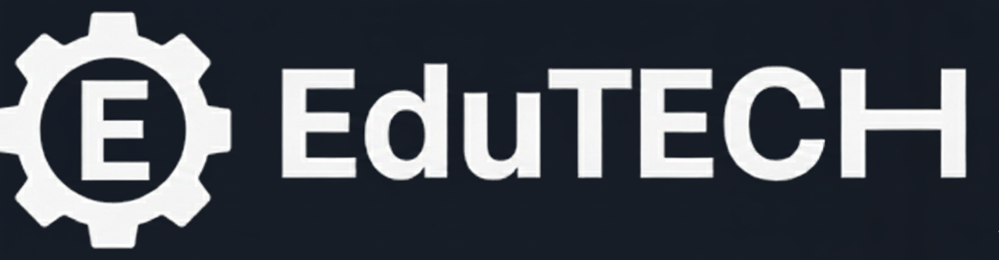
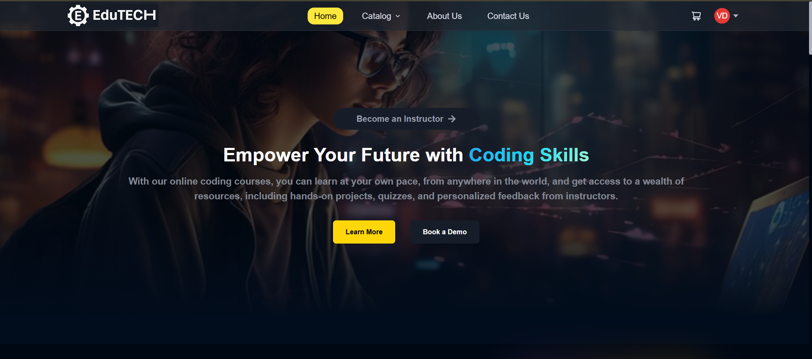
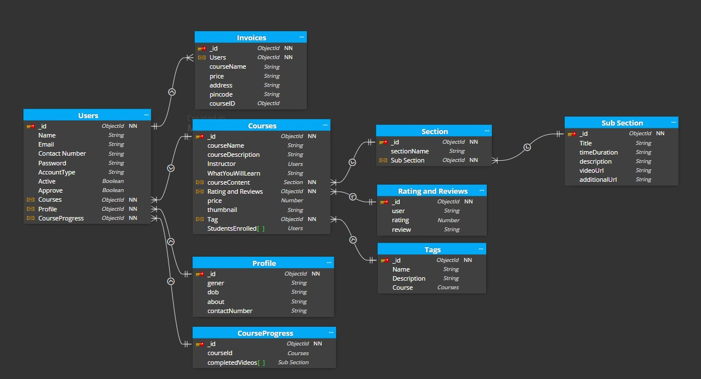
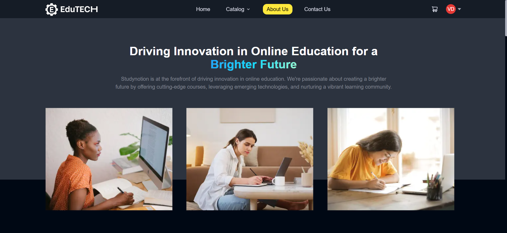
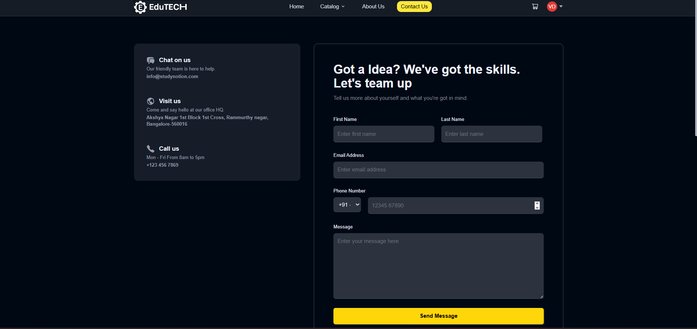
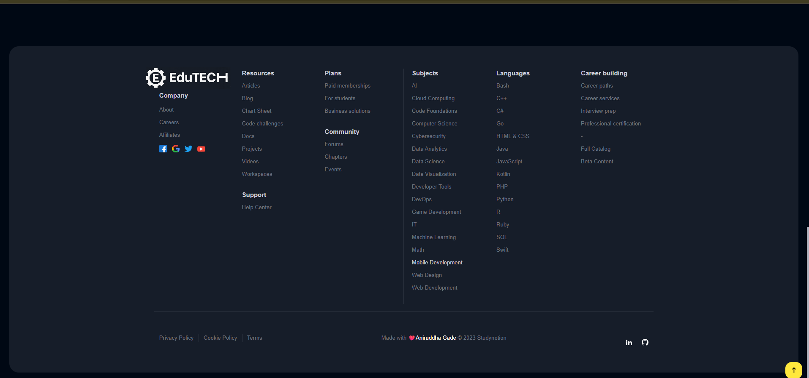

# Project Description 📝
EduTECH is a fully functional ed-tech platform that enables users to create, consume, and rate educational content.  
The platform is built using the **MERN stack**, which includes ReactJS, NodeJS, MongoDB, and ExpressJS.

## Table of Contents

| Section                 | Description                                  |
|-------------------------|----------------------------------------------|
| [EduTECH Aim](#EduTECH-aim-)        | 📚 Overview of EduTECH goals            |
| [Tech Stack](#tech-stack-)             | 💻🔧 Technologies used in the project         |
| [System Architecture](#system-architecture-)    | 🏰 Overview of the system architecture      |
| [Architecture Diagram](#architecture-diagram-)   | 🏗️ Diagram illustrating the architecture   |
| [Schema](#schema-)                  | 🗂 Explanation of data schemas used          |
| [React Hooks](#react-hooks-)            | 🎣 Overview of React Hooks utilized          |
| [React Library](#react-library-)         | ⚛️📚 Overview of React Libraries used        |
| [Screen Preview](#screen-preview-)         | 🖥️ Screen Preview        |

---

## EduTECH Aim 📚 

1️⃣ Provide a seamless and interactive learning experience for students, making education more accessible and engaging.  
2️⃣ Enable instructors to showcase their expertise and connect with learners across the globe.  

---

## Tech Stack 💻🔧 

### Frontend 🎨
<code title="React.js"></code>
<code title="Vite"></code>
<code title="Redux.js"></code>
<code title="CSS"></code>
<code title="Tailwind CSS"></code>

### Backend ⚙️
<code title="Node.js"></code>
<code title="Express"></code>

### Database 🛢️
<code title="MongoDB"></code>

---

## System Architecture 🏰

The EduTECH platform consists of three main components: front end, back end, and database.  
It follows a **client-server architecture**, with the front end as client and the back end & database as server.

- **Front-end:** Built using ReactJS with dynamic interfaces and loading skeletons. Communicates with the back end via RESTful APIs.  
- **Back-end:** Built using NodeJS + ExpressJS. Handles APIs for user auth, course creation, content storage, etc.  
- **Database:** MongoDB stores course content, user data, and other platform information.

---

## Architecture Diagram 🏗️

---

### Front-end Pages

**For Students:**
- Homepage 🏠  
- Course List 📚  
- Wishlist 💡  
- Cart Checkout 🛒  
- Course Content 🎓  
- User Details 👤  
- User Edit Details ✏️  

**For Instructors:**
- Dashboard 📊  
- Insights 📈  
- Course Management Pages 🛠️  
- View and Edit Profile 👀  

---

### Back-end Features

- User Authentication & Authorization 🔐  
- Course Management 🛠️  
- Payment Integration 💳  
- Cloud-based Media Management ☁️  
- Markdown Formatting ✍️  

---

### Database Schema 📋

---

### React Hooks 🎣
- `useState`, `useEffect`, `useDispatch`, `useParams`, `useSelector`, `useLocation`, `useNavigate`, `useRef`, `useForm`, `useDropzone`, Custom-Hook

---

### React Library 📚

- 🚀 **Lazy Loading**: Enhance performance by lazily loading images using the react-lazy-load-image library.  
- 📊 **Chart.js**: Versatile charting library for creating interactive and visually appealing charts.  
- 🎭 **Framer Motion**: Animation library for React, providing smooth and expressive motion.  
- 📁 **React Dropzone**: Drag-and-drop file uploader for React applications.  
- 🍞 **React Hot Toast**: Elegant and customizable toast notifications for React applications.  
- 🔢 **React OTP Input**: Input component for one-time password entry in React forms.  
- 📊 **React Super Responsive Table**: Highly responsive and feature-rich table component for React.  
- 🔄 **Swiper**: Modern touch slider for mobile and desktop browsers.  
- 🖋️ **React Type Animation**: Simple and configurable typing animation component for React.  
- 🎥 **Video React**: React-based video player for building rich multimedia experiences in web applications.  

---

### API Design ⚙️

The LearnHub platform's API is designed following the **REST architectural style**, implemented using Node.js and Express.js. It uses JSON for data exchange and follows standard HTTP request methods such as **GET, POST, PUT, and DELETE**.  

**Sample API Endpoints and Their Functionalities:**

- `/api/auth/signup (POST)` - Create a new user (student or instructor) account.  
- `/api/auth/login (POST)` – Log in using existing credentials and generate a JWT token.  
- `/api/auth/verify-otp (POST)` - Verify the OTP sent to the user's registered email.  
- `/api/auth/forgot-password (POST)` - Send an email with a password reset link.  
- `/api/courses (GET)` - Get a list of all available courses.  
- `/api/courses/:id (GET)` - Get details of a specific course by ID.  
- `/api/courses (POST)` - Create a new course.  
- `/api/courses/:id (PUT)` - Update an existing course by ID.  
- `/api/courses/:id (DELETE)` - Delete a course by ID.  
- `/api/courses/:id/rate (POST)` - Add a rating (out of 5) to a course.  

---
### Screen Preview 🖥️
**Home Page 🏠**  

**About Page**  

**Contact Page**  

**Footer**  

